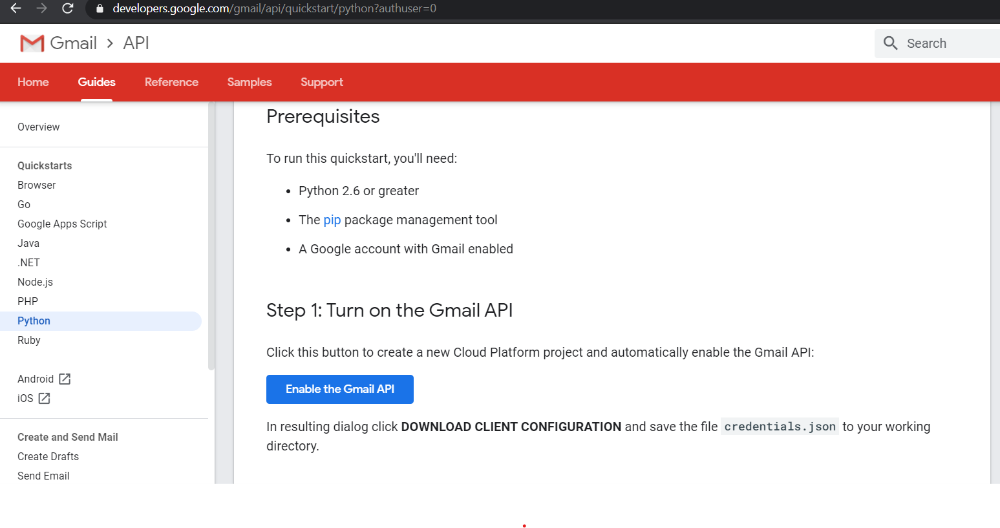
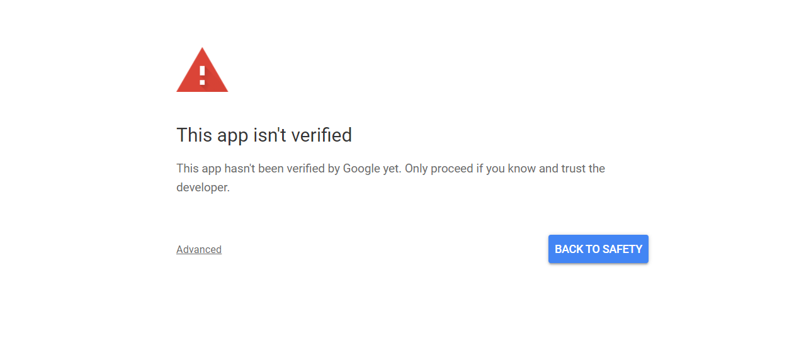
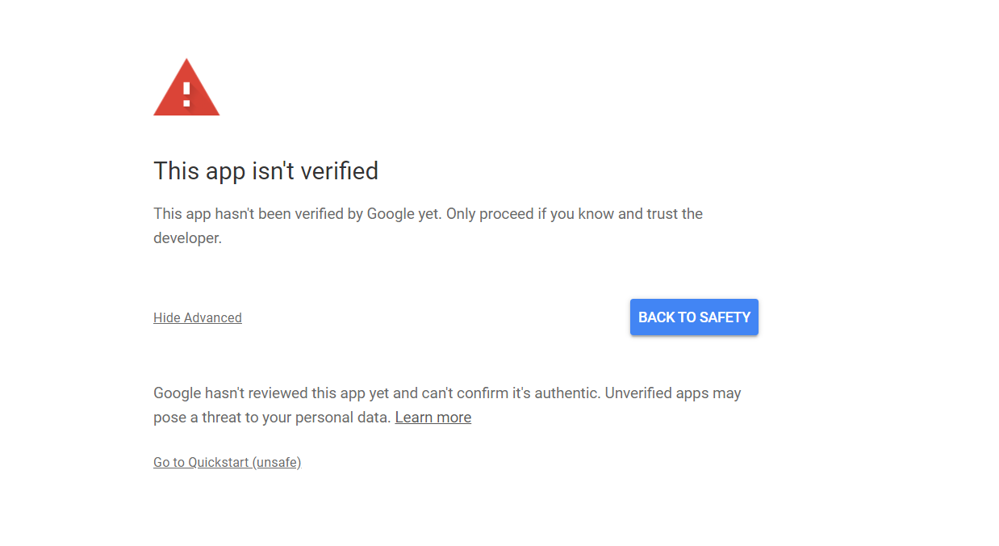
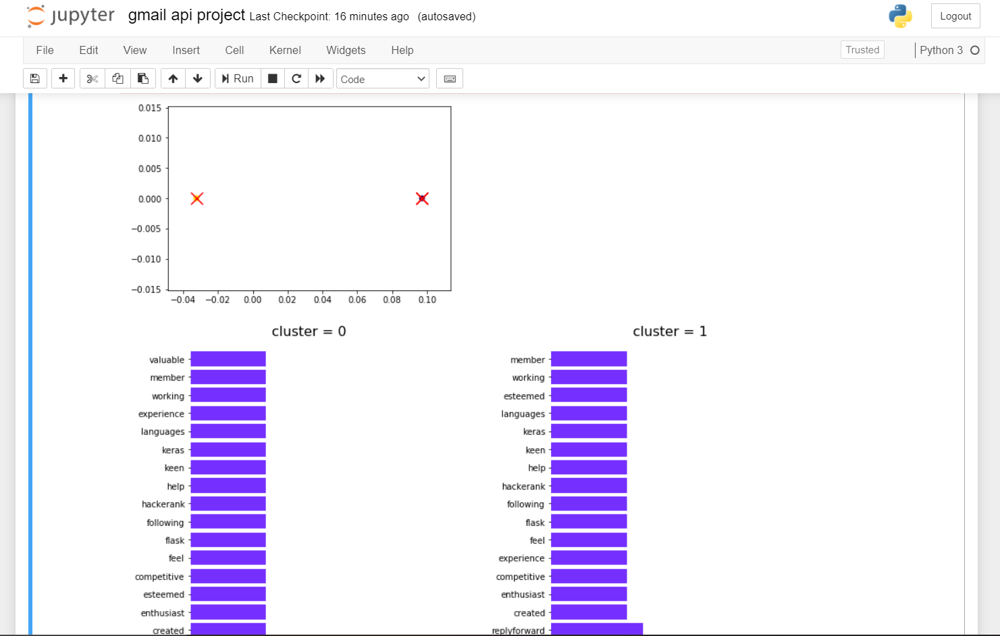

# Email scraping and classification

In this project I have used python as well as googles's gmail API to create a program which can scrape the data from the emails of any particualr gmail ID.
The program checks the INBOX of the target gmail ID and then scrapes the data from the emails which have "Thank You for applying" as a substring in their subject.
After scarping the email body of such emails , the program uses this data and K-means clustering technique to group the emails by creating different clusters which can provide us insights about the data present in the emails and help us to classify according to job category. 

Please go through the following steps to run the program:-
1. please run the following command in your jupyter notebook/(relevant python development environment) to install the required packages before running the program.
    pip install --upgrade google-api-python-client google-auth-httplib2 google-auth-oauthlib
    
    Note:- 
       a)Also please don't forget to download the "helpers.py" file given in this repository and include it in the program directory as it will be used by the porgram to import          and use some relevant functions.\
       b)Also ensure that the number of input samples are greater than equal to the number of number of clusters for error free execution of the code.

2. After the required packages have been installed enable the gmail API by going to the following link (https://developers.google.com/gmail/api/quickstart/python?authuser=0)
    and click on the "enable Gmail API" button.
    
    
    
    
    
    -this will create a new cloud platform project and automatically enble the gmail API.
    -download the credentials file from the resulting dialog box that will appear after clicking on the enable Gmail API button and store it in the directory where you are            running this python program.
    
3. After performing the above steps , run the program. If this app/program has not yet been auhenticated to use the gmail api to scrape the data from target gmail ID then the program will open a new tab in your internet browser where it will ask you sign in (only if you are not signed in with that gmail account) with the target gmail account and to permit this program to ONLY READ AND VIEW the emails from the target gmail account. Proceed as shown (Advanced->Got To Quickstart-> Alllow)

4. Then the program will automatically scrape the data from the relevant emails and use K-means clustering (an unsupervised learning algorithm) to form different clusters along with that it will display the graphical data related to  resulting clusters which will give an insight about what type of information is present in all the emails. This graphical data will help us to gain the information about the "job category" regarding which the user has recieved the emails.

5. The graph represents the cluster centers along with the number of email data points belonging to that cluster (all the clusters have different colors).points blonging to one particular cluster will have similar color.

6. Then the bar graphs Below represents the relevant/important words present in the emails belonging to a particular cluster and their tfidf score. Each cluster has a different bar graph. The screenshot below shows the graphs output of a sample run.

